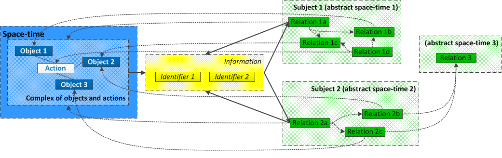
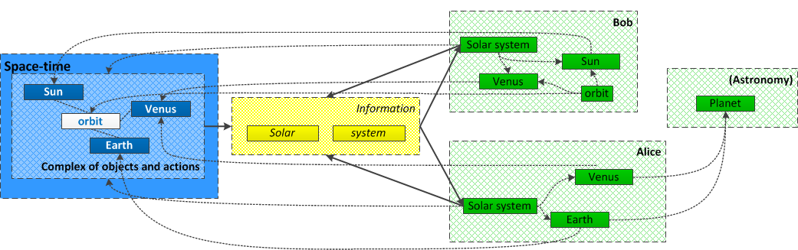
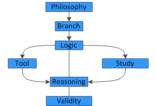

<link rel="stylesheet" href="meaningful.css"/>Meaning
=======

What is meaning?
----------------

Meaning is a complex of relations, which is expressed through identifiers and which corresponds to a complex of object-actions and/or relations.

Object-actions of real space-time flattens to relations of abstract space-time and identifiers used for communicating between different abstract space-times.

### Example 1

1.	Real world object-actions are "Sun", "Venus", "Earth", and "orbit" (the rest of planets are not considered to save space and time).
2.	These object-actions are expressed with "Solar system" identifier.
3.	"Solar system" maps to Bob's model of "Solar system", which is understood by him as "Venus orbits Sun".
4.	"Solar system" maps to Alice's model of "Solar system", which is understood by her as "Venus and Earth".
5.	Alice reads books on astronomy and her relations of both "Earth" and "Venus" refers to astronomy data. Whereas Bob knows "Venus" exists but no more than that.

As you may notice, `Solar system` identifier can be understood differently by parties. But the identifier allows them to communicate about Solar system. Even though `Solar system` has different meaning for Alice and Bob, it has common part as a reference to a real Solar system.

### Example 2

Fire means danger (or rather fear) for some animals. Fire sends identifiers in the form of light and heat, these identifiers compared by animal body with previously memorized ones (abstract space-time of their memory). This activates an instinct, which operates with a reference to fear (in abstract space-time of emotions).

### Example 3

A few definitions of logic:

1.	Logic is the branch of philosophy concerned with the use and study of valid reasoning.
2.	Logic is reasoning conducted or assessed according to strict principles of validity.
3.	Logic is a tool to develop reasonable conclusions based on a given set of data.
4.	Logic is the study of reasoning, or the study of the principles and criteria of valid inference and demonstration.

As we have no real object, nobody may be sure which definition is adequate because:

1.	Definitions of an abstract term are abstract too. Therefore, they are vague, if no underlying axioms, no strict definition, and no references to real world objects.
2.	We may express links between "logic", "reasoning", and "validity" differently.
3.	In fact, logic is (a) reasoning itself, and (b) study of it.

Therefore, if you want to be sure you talk about the same "logic", you need to tell what you mean (give your definition), ask what other party means, and compare both meanings (definitions).

### Example 4

There are some things which are somewhere between real and abstract worlds, for example, movies or applications. If we do not talk about physical storage for them, they are abstract things. But we can refer to them quite precisely, because they consist of abstract objects (scenes or graphical controls), which borders can be strictly defined.

What is what
------------

### Real world

* It consists of geometrical space-time and laws of the Nature (it is questionable if they are a part of space-time or they are define rules of it).
* Object-actions are indivisible from each other, similarly to space and time itself (that is, any action is done by some object, and any object does something in any moment of time).
* Properties of object-actions correspond to manifestations of some laws of the Nature.

### Information

* It is transferred with identifiers (images, sounds, measurements, words)
* Identifiers can be lengthy, for example, a book (which describes some object-actions with corresponding relations through some period).
* Identifiers can be visual (picture, icon) or emotional (signs of agitation), etc.

### Abstract space-time

* Abstract space-time may imitate real space-time or relate to another abstract space-time.
* Relations are basic entities of abstract space-time, they are copies of real object-action or another relation. Because a copy is done with loss of information, it only somehow relates to an origin.
* Abstract space-time may change in time, spawn other abstract space-times and be chained (something that is said by someone, who watched a movie, which based on a book, according with a theory).
* Any abstract space-time may have almost infinite levels of abstraction (starting with one identifier, then with one line definition, one paragraph definition, an article, a book, series of books, etc). 
* If difference of representations may be ignored (assuming they are "more or less the same" or "similar"), then tolerable consistency preferred and corresponding identifiers are used.
* If difference of representations cannot be ignored, then sufficient completeness preferred and definitions of the same term compared.
  
Explanations for [natural language and other approaches](doc/others.md) show existing approaches are not enough to deal with meaning. Therefore, we need to define it from scratch.
   
Meaning from scratch
--------------------

Object-actions of real world are flattened into abstract structures (which we call "relations"). Further, these abstract structures may be flattened again into another relations. For example, `the Earth orbits the Sun` has 3 relations: `the Earth`, `orbits`, and `the Sun`. `the Earth` and `the Sun` are not static objects, they are moving in Universe and the Galaxy, they have inner processes and ones on their surface. `orbit` is not only movement of `the Earth` around `the Sun` but also an infinite row of static `the Earth` positions around `the Sun`. `My friend told me the Earth orbits the Sun` or `A video showing how the Earth orbits the Sun` imply more relations: though your friend and the movie refers to the same complex of relations (`the Earth orbits the Sun`) but they have different level of details and may add something which is not present in the original.

Understanding this, theory of meaning should not rely on "nouns", "verbs", "subjects", "predicates", "objects". More important is to identify what we refer to:
* At first, at level of identifiers. Is it real `the Earth` or Earth from imaginary tale about parallel reality?
* If meaning relates to abstract thing or which has no unique identifier, then we need to identify which relations link it with other meaning/identifiers/relations.
* Of course, through this process, we are to use natural language as identifiers and relations usually expressed with natural language.

Let us consider this on example of complex sentence:

After we left home we could calmly watch Perseids in Switzerland for three days of August.

What is meaning of that? What meaning we can extract if we will get know "we" is a pronoun and "August" is a noun? The real meaning is understanding what identifiers refer to:

* `After we left home` refers to `after August 4, 2015`.
* `we` refers to `Tom Doe and Mary Doe`.
* `home` refers to `100 Main St, Greenfield`.
* `left` refers to the moment when `they took taxi to Greenfield Intl Airport`, then `flew to Frankfurt`, then `flight to Bern`, etc, up to arriving to the observatory in Alpes. In this sentence, it is required only to delineate after which moment of time following events occured.
* `Switzerland` refers to the specific country in space-time.
* `three days of August` refers to `August 12-14, 2015` by `Central European time zone`.
* `Perseids` refers to a `meteor shower` in specific sky sector of `Perseus constellation` (which, in own turn, relates to space-time and is a configuration of starts visible from the Earth in the given epoch).
* `watch` refers to a verb which is similar to `look` and `observe` (and which relates to anything which was available in space-time and seen by specific subjects).
* Finally, `calmly` refers to the fact before leaving home Tom and Mary had not so calm lifestyle.

As you see, the most of meaning could not come from natural language processing (maybe except of `watch`) but are rather data, which can be collected by search engines. Unfortunately, search engines still deals mostly with unstructured text, which would not allow to understand what even `after we left home` means. And that's why proposed approach is needed. At least, because markup allows specifying meaning with hints (that is, we can mark up `home` as `100 Min St, Greenfield`, etc).

Identification
--------------

The first stage for any meaning approach is identification of participants of a considered scope of meaning.
* Natural language: That fully corresponds to natural language approach where words, phrases, sentences, paragraphs, and bigger volumes of text used to identify semantics of complexes of object-actions and relations.
* Current computer approaches: Perfectionism urges to have automatic syntax/grammar/semantic analyzing of text but unfortunately there are still no affordable and reliable framework for this (you can argue that but this would become true only when such framework will be a part of standard framework for any programming language).
* Proposed approach: Use markup for meaning partially ignoring syntax and grammar of natural language. Of course, such approach is less efficient than automatic one but it allows to get at least some reliable results at once.

Are `star system`, `movie star system`, `Sirius star system`, `model of star system`, and `rating star system` (technique for marking rating with star icons) has similar meaning? Maybe, judging by text. No, if you at least can separate meaningful parts of phrases like `star system`, `movie star` + `system`, `Sirius` + `star system`, `model` + `of` + `star system`, `rating star` + `system`. Of course, such separation does not produce meaning by itself but at least it helps to distinct different groups of meaning.

Default relation
----------------

As it is stated before, object-actions flattened to "relations" and all identifiers refer to these "relations". However, it is not very convenient to call everything as "relation", therefore further under "relations" we understand only the most generalized ones, which are applicable in the most of situations, whereas more specific relations are called "identifiers". Thus, in `Earth orbits the Sun` there are 3 identifiers (`Earth`, `orbits`, `the Sun`) and at least 2 relations (`does` and `does what`).

We start with the most common relation: default one. It is denoted with a whitespace in English and similar languages. For example in `Earth orbits the Sun`, there are 3 default relations but the one between `the` and `Sun` can be omitted as `the Sun` is one identifier (at least, from the point of view of meaning but maybe not for language itself). Other 2 relations (if not specified) are default ones:

Earth rel orbits rel the Sun

That is, these identifiers are linked somehow but we don't know how exactly.

Sameness, similarity, abstraction, specification
------------------------------------------------

The second stage for meaning is comparison of identifiers between each others. In fact, these 4 relations introduce a sort of "strict equality", "loose equality", "greater than", and "less than" operators for meaning.
* Natural language: There are no "embedded" mechanisms for that except of pronouns, which may refer to the same person/thing in scope of a text unit. Though, of course, natural language allows to express any of these relations indirectly (with several words/phrases/sentences).
* Current computer approaches: Examples for these relations we may find in programming languages or in HTML (where a hyperreference may express abstraction and specification but there is no distinction between these relations).
* Proposed approach: All these relations must be used explicitly.

`the Solar system`, `Solar system`, `Systeme solaire`, or `le Système solaire` or `it` (in the sentence where Solar system was mentioned) refers to the same system of the Sun and planets. Slightly more complex example: 

The Solar System is the gravitationally bound system comprising the Sun and the objects that orbit it, either directly or indirectly 

Solar system is the Sun and 8 planets which orbit it

Of course, it is the same Solar system but scope of definition differs: `8 planets which orbit it` *abstracts* `the objects that orbit it`.

### is the same

Indicates if an identifier refers to the same object-action and/or relation.

Earth orbits [/]the Sun[/#1] and heated by [/]it[/#2 is the same #1]

### is similar

Indicates if an identifiers refers to similar object-actions and/or relations.

The Sun [is similar] Sirius

### abstracts / specifies

`[abstracts]` indicates an identifier of smaller similar content, whereas `[specifies]` indicates an identifier of bigger smaller content:

Mars [abstracts] https://en.wikipedia.org/wiki/Mars    
Mars [abstracts] the fourth planet from the Sun, which is often referred to as the "Red Planet" because the iron oxide prevalent on its surface gives it a reddish appearance    
https://en.wikipedia.org/wiki/Mars [specifies] Mars    
The fourth planet from the Sun, which is often referred to as the "Red Planet" because the iron oxide prevalent on its surface gives it a reddish appearance [specifies] Mars

Types, instances, conditions, cause-effect
------------------------------------------

Types types *abstract* similar meaning. Strictly speaking, a type is a group of at least 2 instances of something with at least 1 common feature. A condition is criteria of similarity of instances inside the same type. Cause-effect is conditions with time order. But, of course, conditions and cause-effects are used not only for types.
* Natural language: There are some constructions for this, which are explicit to some degree, but usually types are not evident and expressed through definitions.
* Current computer approaches: In computer technologies type systems flourish (but they may have different definition of "type"). It was unavoidable as any application clones some data/objects/behavior.
* Proposed approach: Uses types, instances, conditions, and cause-effect explicitly.

Venus and the Earth are planets

`Venus` and `the Earth` are instances of `planet` by definition (in most of cases, we take this as granted). It is implied `Venus` is *similar* to `the Earth` at least by 1 common feature and `planet` is a word for all similar objects.

menu has part menu item

context menu is instance of menu

desktop has context menu has part Properties

Type implies similarity of relations. If `desktop context menu` *is instance of* `menu`, which *has part* `menu item`, then `Properties` which *is part of* `desktop context menu` is `menu item` too.

A planet is an astronomical object orbiting a star that

is massive enough to be rounded by its own gravity

is not massive enough to cause thermonuclear fusion

has cleared own neighbourhood

Definition of `planet` type includes several conditions (one of which is "cause-effect" one: `not massive enough to cause thermonuclear fusion`). Both `Venus` and `the Earth` has specific properties which satisfies these conditions.

A solar eclipse occurs if the Sun is temporarily obscured by the Moon, which passes between the Sun and the Earth.

A solar eclipse occurs because the Sun is temporarily obscured by the Moon, which passes between the Sun and the Earth.

Sometimes a condition and a cause-effect are interchangeable because condition implies actions.

I have finished my work and went home.

If you finish your work, you go home.

If you have finished your work, you would go home.

Since you have finished your work, you may go home.

You can see usually conditions are just a complex of object-actions and relations which are can be considered as condition / cause-effect in one moment time and be realized in another.

Ice melts if temperature is above 0 C

Ice melts as temperature now is above 0 C

When we deal with mathematical condition, then we use special comparison operators. But that is not the problem for natural language, which may convert them into the fact (`temperature is above 0 C`). This happens when we cannot indicate temperature precisely and comparison operators allow fuzzy definition.

### is type of / is instance of

`[is type of]` and reverse `[is instance of]` relations indicate a name of a group of similar object/actions and/or relations or instances of such group.

star [is type of] The Sun    
The Sun [is instance of] star

### has condition / is condition of

`[has condition]` and `[is condition of]` refer to relation between a condition and a consequence, which could be or could not be not ordered in time.

OS_like_OS [is done] run [has property] on [/]computer [/#c has #1] with  
	[/]1 [#2] [@math greater than] [@math units of] GHz[#3] or faster [/]  
	processor[/#1] [has property frequency] [has condition #2]  

### causes / caused by

`[causes]` and `[caused by]` refer to relation between a cause and an effect which are to be ordered in time.

Earth [causes] lunar eclipse

lunar eclipse [caused by] Earth

Undefined Is, Has, Of
---------------------------------

* Natural language: `is`, `has`, `of` are relations which used in natural language (at least, in English) as is. That is, they correspond to usage of these words in text unit of natural language.
* Current computer approaches: Present implicitly in some constructs.
* Proposed approach: To use it to be compatible with natural language. `has` relation is considered as reverse to `of`.

Color of the Sun is yellow 

The Sun is yellow 

The Sun has yellow color

Please note, when we tell `fly is move through the air` we use undefined `is` but, in fact, it is rather `is similar` or `is instance of` relation.

### is

`[is]` relation is undefined relation for others like `[is similar]`, `[is the same]`, etc.

The Sun [is] star

### has / of

`[has]` relation is undefined relation for others like `[has part]`, `[has property]`, etc. `[of]` relation is undefined relation for others like `[is part of]`, etc (which overlaps with undefined `is` relations).

The Sun [has] atmosphere

atmosphere [of] The Sun

### Ambiguities

color is yellow

yellow  color

Please note, for example, `[has value]` usually is expressed with undefined `is`, whereas `[is value of]` usually is expressed with default relation (whitespace).

Structural (spatial) relations
------------------------------

Structural relations implied in natural language but usually they expressed through default or undefined relations like `is`, `has`, and `of`. However, different kinds of structural relations should be discerned as it is done in computer technologies because they have different meaning.

* `has part` / `is part of`. Grouping or partitioning of something or someone.
* `has property` / `is property of`, `has value` / `is value of`. Not spatial and not temporal characteristics of object-actions or relation, which may exist in parallel with other properties (unlike parts of the whole, which usually are not overlapped if not stated otherwise).
* `has possession` / `is possession of`. A variant of `has property` / `is property of`, applicable to external property of humans.

Compare specific structural relations with undefined ones:

The Sun has part atmosphere has property color has value yellow

The Sun has atmosphere has color has yellow

 

yellow is value of color is property of atmosphere is part of the Sun

yellow is color of atmosphere of the Sun

### has part / is part of

`[has part]` and reverse `[is part of]` relations express inclusion of things.

The Sun [has part] atmosphere

atmosphere [is part of] The Sun

### has id / is id of

`[has id]` and reverse `[is id of]` relations express one or several properties which identify object-actions and/or relations.

star [has id] name

name [is id of] star

### has property / is property of

`[has property]` and reverse `[is property of]` relations used for property of things (that is, some of their characteristics, which does not belong to spatial structure).

The Sun [has property] color

color [is property of] The Sun

### has value / is value of

`[has value]` and reverse `[is value of]` relations indicate values of properties.

color [has value] yellow

yellow [is value of] color

	
Behavioral (temporal) relations
-------------------------------

* `does` / `done by`, `is done` / `does what`. A relation between objects and actions, which corresponds to subject-predicate-object scheme.

Earth orbits The Sun 

The Sun orbited by Earth

### does / done by, is done / does what

`[does]` is a relation between a subject and a predicate, and `[does what]` between a predicate and an object. `[is done]` and `[done by]` links object/predicate/subject in different direction.

Earth [does] orbits [does what] The Sun

The Sun [is done] orbited [#1 done by #2] by [/] Earth [/#2]

Direction of order could matter less if we express object and complements with `has` or `has property`.

Earth [does] orbit [has property] The Sun 

Earth [has] orbit [has property] The Sun 

	
Other types of relations (spatial, temporal, mathematical, logical, etc)
------------------------------------------------------------------------

There are a lot of relations, which are specific for different aspects of reality and abstract space-times:

* `Behind`, `beyond`, `under`, `over`, and other spatial ones.
* `After`, `before`, `then`, `period`, `moment`, and other temporal ones.
* `True`, `false`, `and`, `or`, and other logic ones.
* `Less than`, `greater than`, `equals`, and other math ones.
* `All`, `each`, `some`, and other quantification ones.
* Many other types of relations, which may exist almost in any area of human activity.

OS_like_OS [is done] run [has property] on [/]computer [/#c has #1] with  
	[/]1 [#2] [@math greater than] [@math units of] GHz[#3] or faster [/]  
	processor[/#1] [has property frequency] [has condition #2]  

Grouping
--------

Grouping used when meaning should be referred by shorter identifier:

OS_like_OS desktop [is the same] [/] OS_like_OS [has] desktop [/#1]

Context
-------

Context is an abstract space-time, in which scope meaning given. Usually context is implied but not always.

Tom thinks cold is -10 C

Mary thinks cold is 0 C

5 years ago Mary thought cold is 5 C but now thinks it is under -5 C

Near ocean Tom thinks cold is -5 C and in town it is -10 C

Here `cold` is defined in context of (1) Tom, (2) Mary, (3) Mary 5 years ago and Mary now, (4) Tom near ocean and Tom in town. But, of course, context is not restricted only with what we think about things.

In 1960 world population reached 3 billions

Now the Earth bears around 7 billions

First, `world` means `the Earth`. Second, `the Earth` in the first sentence is in `1960` and in the second one is in `2016`, which won't be `now` year later. Third, `billions` implies `people`. Usually this can be indicated just by explicit values for corresponding identifiers.

Now[@time "2016"] the Earth bears around [/]7 billions[@math units of "people"]

In cases when some context is implied it means an explicitly expressed complex of object-action-relations somehow relates to an implicitly expressed complex of object-action-relations:

There Tom was exhilarated by volcano views[rel]

[/] Iceland [@space], [/]May 2015[/#1t @time] [/#1]

Abstract space-times, transformations (map, reduce, filter)
-----------------------------------------------------------

Abstract space-time is inherent to any subject which perceive, feel, understand or process information from real world in this or that way. Further, this information may be transformed even more and, finally, it may be transformed in a separate space-time which may have a separate existence (book, movie, application, etc).

From the point of view of meaning at least we should discern a reference to real space-time and abstract space-time. As for now, it is implied by default all references relate to real space-time otherwise they should be marked as ones belonging to some abstract space-time.

Mary told me [/]what she thinks about Venus[/ @Mary]

Abstract space-times may be referred in chain (this is a draft of syntax):

Tom knows Mary imagines

[/]

Venus as she have seen it in "The second in Solar system" movie

[/ @Mary@TheSecondInSolarSystem]

Though `Venus` identifier could be the same in any abstract space-time but similarity with original planet may be insignificant or even not real (for example, in a space of some fantasy tale about unreal Venus). Such crucial changes are result of transformation, which always accompanies referring from real or abstract space-time to abstract one. Usually, such transformation reduces or increases volume of information (which expressed with `[abstracts]` and `[specifies]` relations), but also it can isolate facts related to specific ares (for example, `Venus chemistry` is an abstract space-time of Venus, which contains only chemistry related knowledge, that is, `Venus[@chemistry]`), but finally it also maps `Venus` object-action to some abstract `Venus` object-action. Please note, pure mapping, reducing, or filtering are possible only in pure abstract transformations, in realitfy transformations always include grains of all of these transformation types.

Data and metadata
-----------------

Do we need special definitions for regular data and so called metadata? Rather not than yes. Regularity of data is based on similarity (and expressed through types, classes, tables, etc), which is in core of the proposed approach. So called metadata is just a description of similarity:

Planet [has id] name

Planet [has property] diameter [and] number of satellites

Data (it is implied `Earth` is instance of a planet and an identifier of corresponding planet):

Planet [is type of] Earth

Earth [has property] diameter [has value] 12756 km [and] number of satellites [has value] 1 

Do we need to define type of properties like `string` or `number`? In fact, such more precise approach might not work in all cases when information is defined inaccurately or vaguely. Thus, for diameter values could be 'twelve million meters' or 'almost 4 times less than the Moon one'.

Identification-similarity-abstraction-specification-classification revisited
----------------------------------------------------------------------------

Now, when we are familiar with base relations let us reconsider the process of meaning defining on the example of the Pluto planet-mass object and the Solar System.

### Identification

Pluto

`Pluto` word is not enough to identify exactly what we mean, therefore we need either to indicate more precise meaning with additional words or to add context (by specifying implicit information).

Pluto [is] planet

Pluto [rel "astronomy"] 

Pluto [rel "Solar System"] 

Please note, `implies "Solar System"` could not be precise enough as other meanings of `Pluto` are located in the Solar System too: for example, in mythology of nations, which live in the Solar System.

### Similarity

In fact, similarity was already introduced at the previous step.

Pluto [is similar] planet

Usually `is` is undefined relation, which is widely used in natural language and which usually means `is similar`.

Solar System [is similar] planetary system

Statement of similarity is enough only in the cases, when we are coerced to use or constrained with vague similarity. Otherwise, we need to specify how exactly things or conceptions are similar more precisely. In general, it is hard to say where is a boundary between identification, similarity, abstraction, types, and other relations.

### Abstraction

Abstraction is rather "enhanced" type (or description) of similarity.

The Solar System is the Sun and its planets.

The Solar System is the gravitationally bound system comprising the Sun and the objects that orbit it, either directly or indirectly.

The Solar System is is restricted with boundaries of the Oort cloud (a theoretical cloud of predominantly icy planetesimals believed to surround the Sun).

In all sentences `is` implies `abstracts`, that is, `the Solar System` word abstracts either (1) the Sun and the planets, or (2) the Sun and gravitationally bound objects, or (3) space(-time ?) inside the Oort cloud. As you can see, `abstracts` is advanced version of `is similar`: (1a) the first variant specifies the biggest objects of it, (2a) the second one specifies all objects by a template which were and will be a part of the Solar System, (3a) the third one specifies the Solar System as a part of space (but possibly not time). That is, the third definition implies geometrical border for both physical objects and vacuum (through which the Solar System comes in Galaxy).

The first definition also `abstracts` the second one but the third one is totally different: it considers the Solar System as a part of space but not object-actions bound by gravitation. We can see here even the same identifier (`the Solar System`) could have slightly different meaning depending on criteria of similarity.

### Types

The previous example for the Solar System already has good example of a type of `the Solar system object` which may be rephrased so:

The Solar System object is an object that gravitationally bound to the Sun and that orbits it, either directly or indirectly.

What we see here is an identifier on the left and a specification of the identifier on the right. The specification consists of conditions, which define boundaries of similarity. Please note, "type" could be both an "abstraction" (`The Solar System is the Sun and its planets`), which includes only actual similar object-actions, but also an "abstraction" of "abstraction" and include criteria of similarity, which were matched, are matched or will be matched by specific object-actions.

Planet is

is in orbit around the Sun,

has sufficient mass to assume hydrostatic equilibrium (a nearly round shape), and

has "cleared the neighborhood" around its orbit.

Now, let us return to the Pluto. As you may know, the Pluto was deprived of this name and re-classified to "dwarf planet" because several objects (similar to the Pluto) were found near its orbit. This is real world example of what happens if some object does not satisfy criteria of similarity: in this case a new type is created by adding a new condition (here it is the third line about "clearing the neighborhood").

What's about mass production or, say, computer objects? Mass production objects are more or less similar only right after manufacturing (though any material is not fully homogeneous) but after some usage they could become more and more differentiated. The story is different for computer objects: they are creatures of abstract world, which allows full equality by definition. For example, we can say that you won't be able to write exactly the same "1" digit twice but "1" digit in minds of billion peolpe will be precisely equal. But, of course, such precise equality is not achievable as soon as an abstract thing requires complex definition.

### Structural, behavioral, and other relations

Types may include not only criteria of similarity for objects themselves but also criteria of similarity of their constituents.

Planet has mass, atmosphere, and magnetosphere.

Similarly "abstract" criteria like `the Sun and planets` may be specified by:

The Solar System consists of the Sun, the planets (Mercury, Venus, Earth, Mars, Jupiter, Saturn, Uranus, Neptune) and their satellites, comets, asteroids, meteoroids, and the interplanetary medium.

That is, the choice of "abstraction" or "specification" may be manyfold, depending on what is needed: completeness or consistency. As a extreme point of completeness you can imagine full catalogue of all known objects of the Solar System, which will the most precise description of it until a new object found. As a extreme point of consistency you can consider one line definition of the Solar System.

Therefore we need to understand the process, which involves identification-similarity-abstraction-specification-classification is integral and boundaries between its parts are not strict.